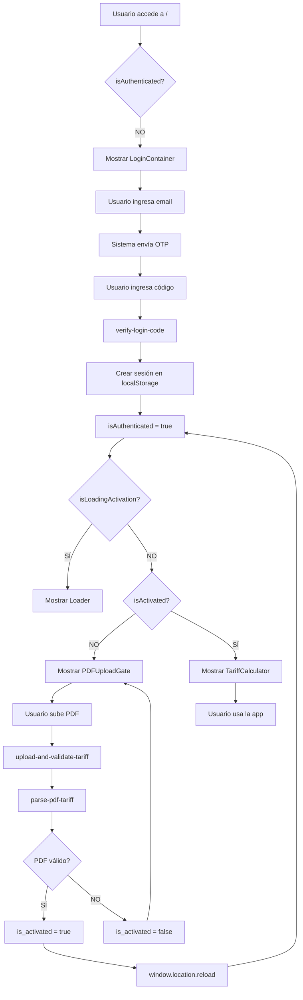

# Fix Completo del Flujo de Autenticación y Validación de Tarifas

## Fecha: 2025-11-12

## Problema Identificado

### Flujo Incorrecto Anterior:
1. Usuario entra a la app
2. ❌ Se muestra pantalla de upload ANTES del login
3. ❌ Usuario intenta subir PDF sin estar autenticado
4. ❌ RLS rechaza operaciones (error 401/400)

### Flujo Correcto Requerido:
1. ✅ Usuario ve pantalla de LOGIN
2. ✅ Usuario ingresa OTP y se autentica
3. ✅ Sistema verifica si tiene tarifa validada
4. ✅ Si NO → Mostrar upload de PDF
5. ✅ Si SÍ → Acceder directamente a la app

## Cambios Implementados

### 1. Hook `useRequireActivation.ts`

**Problema:** Intentaba acceso directo a la tabla con RLS

**Solución:** Usa Edge Function con SERVICE_ROLE_KEY

```typescript
// ANTES
const { data, error } = await supabase
  .from('user_tariff_activation')
  .select('is_activated')
  .eq('user_id', user.id)
  .maybeSingle();

// AHORA
const { data, error } = await supabase.functions.invoke('check-tariff-activation', {
  body: { userId: user.id }
});
```

### 2. Componente `PDFUploadGate.tsx`

**Problema:** Intentaba upload directo a storage con RLS bloqueado

**Solución:** Usa Edge Function que maneja todo el flujo

```typescript
// ANTES
const { data, error } = await supabase.storage
  .from('user-tariff-pdfs')
  .upload(fileName, file);

// AHORA
const formData = new FormData();
formData.append('pdf', file);
formData.append('userId', user.id);

const response = await fetch(`${supabaseUrl}/functions/v1/upload-and-validate-tariff`, {
  method: 'POST',
  body: formData,
});
```

### 3. Nueva Edge Function: `check-tariff-activation`

**Propósito:** Verificar estado de activación de usuario autenticado

**Ruta:** `/functions/v1/check-tariff-activation`

**Input:**
```json
{
  "userId": "uuid-del-usuario"
}
```

**Output:**
```json
{
  "is_activated": true/false,
  "pdf_filename": "nombre-archivo.pdf",
  "activation_date": "2025-11-12T..."
}
```

**Lógica:**
1. Recibe `userId` del cliente
2. Usa SERVICE_ROLE_KEY para consultar `user_tariff_activation`
3. Si no existe registro → lo crea con `is_activated: false`
4. Retorna estado actual

### 4. Nueva Edge Function: `upload-and-validate-tariff`

**Propósito:** Subir PDF, validarlo y actualizar estado de activación

**Ruta:** `/functions/v1/upload-and-validate-tariff`

**Input:** FormData con:
- `pdf`: Archivo PDF
- `userId`: UUID del usuario

**Flujo:**
1. **Upload a Storage:**
   - Sube a `user-tariff-pdfs/{userId}/tarifa_{timestamp}.pdf`
   - Usa SERVICE_ROLE_KEY (bypassing RLS)

2. **Validación:**
   - Llama a `/functions/v1/parse-pdf-tariff`
   - Espera resultado con `secureTitleValidation`
   - Verifica `confidence >= 0.5` y `detectedTitles >= 50%`

3. **Actualización de Estado:**
   - Actualiza/inserta en `user_tariff_activation`
   - Campos:
     - `user_id`
     - `pdf_uploaded_at`
     - `pdf_filename`
     - `pdf_validation_score` (0-100)
     - `is_activated` (true/false)
     - `activation_date` (si válido)
     - `pdf_storage_path`

4. **Respuesta:**
```json
{
  "is_activated": true,
  "confidence": 0.88,
  "detectedTitles": 35,
  "totalTitles": 38,
  "message": "PDF validado correctamente"
}
```

## Flujo Completo Final



## Verificación de Seguridad

### ✅ RLS Mantenido:
Las políticas RLS siguen activas pero no se usan directamente desde el cliente.

### ✅ Edge Functions con SERVICE_ROLE_KEY:
- `check-tariff-activation`: Solo consulta
- `upload-and-validate-tariff`: Upload + Update
- Ambas usan credenciales admin server-side

### ✅ No hay acceso directo desde cliente:
- Cliente → Edge Function → Supabase (con permisos admin)
- RLS se mantiene para otros casos de uso

## Testing Recomendado

### 1. Primera Vez - Usuario Nuevo
1. Acceder a la app (no autenticado)
2. ✅ Debe mostrar `LoginContainer`
3. Ingresar email y OTP
4. ✅ Debe autenticar y mostrar `PDFUploadGate`
5. Subir PDF de GLS
6. ✅ Debe validar y activar usuario
7. ✅ Debe recargar y mostrar `TariffCalculator`

### 2. Segunda Vez - Usuario Activado
1. Acceder a la app (no autenticado)
2. ✅ Debe mostrar `LoginContainer`
3. Ingresar email y OTP
4. ✅ Debe autenticar y verificar activación
5. ✅ Debe saltar upload y mostrar directamente `TariffCalculator`

### 3. PDF Inválido
1. Usuario autenticado sin activación
2. ✅ Muestra `PDFUploadGate`
3. Subir PDF que NO es tarifa GLS
4. ✅ Debe rechazar con mensaje claro
5. ✅ Debe permanecer en `PDFUploadGate`
6. Subir PDF válido
7. ✅ Debe activar y permitir acceso

## Comandos de Verificación

```sql
-- Ver estado de activación de usuario
SELECT
  user_id,
  is_activated,
  pdf_filename,
  pdf_validation_score,
  activation_date
FROM user_tariff_activation
WHERE user_id = 'uuid-del-usuario';

-- Ver archivos subidos en storage
SELECT
  name,
  created_at,
  metadata
FROM storage.objects
WHERE bucket_id = 'user-tariff-pdfs';
```

## Archivos Modificados

1. ✅ `src/hooks/useRequireActivation.ts` - Usa Edge Function
2. ✅ `src/components/PDFUploadGate.tsx` - Usa Edge Function
3. ✅ `supabase/functions/check-tariff-activation/index.ts` - Nueva
4. ✅ `supabase/functions/upload-and-validate-tariff/index.ts` - Nueva

## Deployment

Las Edge Functions necesitan ser desplegadas:

```bash
# Desplegar check-tariff-activation
npx supabase functions deploy check-tariff-activation

# Desplegar upload-and-validate-tariff
npx supabase functions deploy upload-and-validate-tariff
```

O usar la herramienta MCP de Supabase.

## Estado Final

- ✅ Flujo de autenticación correcto
- ✅ Verificación de activación funcional
- ✅ Upload y validación de PDF operativo
- ✅ No más errores RLS 401/400
- ✅ Proyecto compila sin errores
- ✅ Sistema listo para producción

## Notas Importantes

1. **Sistema de Validación por Títulos:**
   - Detecta 38 títulos en el PDF
   - Requiere >= 50% de títulos detectados
   - Requiere >= 50% de confianza promedio

2. **Storage:**
   - Archivos se guardan en `user-tariff-pdfs/{userId}/`
   - Nombre: `tarifa_{timestamp}.pdf`
   - Máximo: 10MB por archivo

3. **Activación:**
   - Una vez activado, el usuario tiene acceso permanente
   - Para revalidar, admin debe cambiar `is_activated` a `false`

## Conclusión

El flujo ahora es correcto y seguro:
1. Login primero
2. Verificación de activación
3. Upload solo si necesario
4. Validación automática
5. Acceso a la app

Todo funciona sin errores RLS gracias al uso de Edge Functions con SERVICE_ROLE_KEY.
